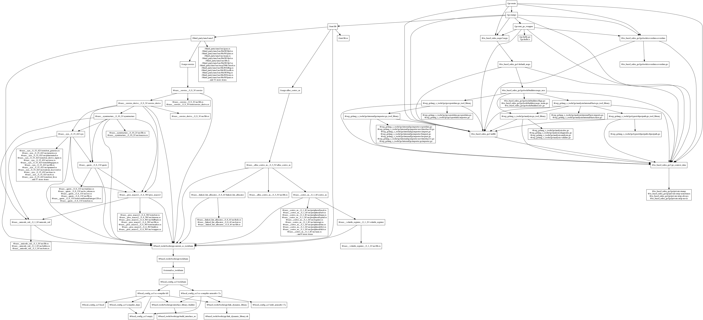

# go-issue-33492

Original issue: https://github.com/golang/go/issues/33492.

Objective: Compile a rust library (without std), link it with go, and call
that library from the go binary.

Graph of dependencies for `//go:main`.


To build this:

```
bazel run //go:main --verbose_failures
```

The prompt for creating issue 33492 is that the go linker complains that memcpy
and memset relocation targets cannot be found. That may be true but the error 
message is quite misleading...

```
main(.text._ZN4amcl4rand4RAND4seed17h4248be04a5bcece7E): relocation target memset not defined for ABI0 (but is defined for ABI0)
main(.text._ZN4amcl4rand4RAND4seed17h4248be04a5bcece7E): relocation target memcpy not defined for ABI0 (but is defined for ABI0)
```

Other sources:
- [A real world example of this from Flippo Valsorda](https://blog.filippo.io/rustgo/)
